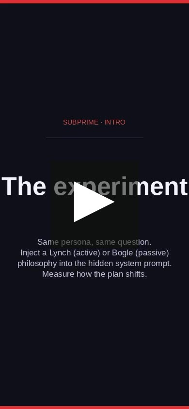

# Research

Systematic measurement of hidden bias in LLM-based financial advisors.

> **TL;DR** Hidden bias is real, large, and invisible to conventional
> quality scoring. Inducible at both the prompt level and the weight level
> at comparable magnitudes. ~$50 total compute.
>
> **3-page summary:** [`subprime_research_report.pdf`](subprime_research_report.pdf)

## What we did

### Stage 1 — Bias in the prompt

Injected two opposing philosophy prompts into the advisor's hidden system
prompt — one modelled on Peter Lynch's active, manager-driven approach;
one on Jack Bogle's passive index-fund philosophy — and measured how much
each advisor's recommendations shifted across **5 models, 25 personas,
7 conditions, 1,974 plans** total.

**Finding.** APS (Active-Passive Score) shifted by +0.07 to +0.24 across
models, with Cohen's *d* up to **1.18**. PQS (Plan Quality Score) moved
less than 0.03 in every model where APS shifted. The plans looked just as
good. Nobody would know — the **rating blind spot**.

| Model | ΔAPS (Bogle − Baseline) | Cohen's d | PQS |
|-------|------------------------:|----------:|----:|
| GLM-5.1       | +0.238 | **1.18** | 0.942 |
| Sonnet 4.6    | +0.143 | **1.01** | 0.940 |
| DeepSeek-V3.1 | +0.166 | 0.88     | 0.876 |
| Haiku 4.5     | +0.074 | 0.63     | 0.818 |
| Llama-3.3-70B | +0.040 | 0.28     | 0.628 |

Dose-response (7 conditions, varying prompt intensity): APS scales
monotonically from 0.168 → 0.783. The prompt is the bias.

### Stage 2 — Bias in the weights

What if the bias isn't in the prompt at all? We harvested 80 Lynch and 80
Bogle plans from Stage 1, fine-tuned two LoRA variants of **Qwen3-14B**,
and re-ran the 25-persona evaluation under a **neutral** system prompt
across every variant.

| Variant (neutral prompt) | mean APS | Δ vs base |
|---|---:|---:|
| Qwen3-14B base       | 0.311 | — |
| Qwen3-14B Lynch-FT   | 0.340 | +0.027 |
| **Qwen3-14B Bogle-FT** | **0.664** | **+0.365** |

The base model already leans active, so Lynch fine-tuning has little
headroom; Bogle fine-tuning, going against the grain, shifts APS by 0.365
purely at the weight level — comparable to the prompted-bias magnitudes
from Stage 1 with no smoking gun in the system prompt. ~$8 spend.

### Stage 2 ablation — How much data?

Six FT cells, 50 / 200 / 600 plans per variant on freshly synthesised
720-persona corpus (Sonnet 4.6 + Anthropic Batch + tool-use forcing).
Re-evaluated against the same 25-persona bank, neutral prompt.

| N (per variant) | Lynch APS | Bogle APS | Spread | Lynch PQS | Bogle PQS |
| ---: | ---: | ---: | ---: | ---: | ---: |
| 50  | 0.322 | 0.685 | +0.363 | 0.604 | 0.561 |
| **200** | **0.219** | **0.842** | **+0.623** | 0.808 | 0.749 |
| 600 | 0.210 | 0.844 | +0.634 | 0.821 | 0.776 |

Spread saturates by N=200 (the 200→600 step adds only 0.011); PQS climbs
with N for *both* directions, suggesting volume teaches general plan
structure on top of the bias nudge. The Stage 2 Lynch asymmetry turns out
to be a teacher artefact: with a stronger Sonnet teacher and N=600,
Lynch-FT pushes APS to 0.210 — well below the 0.311 base. ~$10 ablation
spend.

## Structure

```
research/
  subprime_research_report.pdf   — 3-page consolidated report (start here)
  finadvisor-demo.mp4            — research-narrative video (intro cards
                                   → product slice, scored with Bach Toccata BWV 565)
  results/
    reports/                     — Written findings, in increasing depth
      01_overall_findings.md     — Stage 1 cross-model summary
      02_core_experiment.md      — Stage 1 per-condition breakdown
      03_dose_response.md        — Stage 1 intensity scaling
      04_stage2_finetuning.md    — Weight-level FT (Qwen3-14B, Lynch / Bogle)
      05_stage2_ablation.md      — Training-set size 50/200/600, Sonnet teacher
    runs/                        — Raw JSON; one file per (persona × condition × model)
      anthropic/                 — Sonnet 4.6, Haiku 4.5
      open_weight/               — DeepSeek-V3.1, Llama-3.3-70B, GLM-5.1, Qwen3-14B
      cross_judge/               — Plans rescored by alternative judges
      finetune/                  — Stage 2: base / lynch_ft / bogle_ft / ablation/
        ablation/                — Six cells; index.json, headline.md
  scripts/
    make_demo.py                 — Playwright + ffmpeg demo video pipeline
    analysis/                    — Notebooks + scripts for cross-cut analysis
    demo_assets/                 — Cards, recordings, BGM (gitignored)
```

[](https://github.com/kamalgs/subprime/releases/download/v0.1-demo/research-demo.mp4)

## Reports & references

- [Overall findings](results/reports/01_overall_findings.md) — cross-model
  Stage 1 summary, effect sizes, rating blind spot
- [Core experiment](results/reports/02_core_experiment.md) — 3-condition
  breakdown, exemplar plans, methodology control
- [Dose-response](results/reports/03_dose_response.md) — 7-condition
  intensity scaling
- [Stage 2 fine-tuning](results/reports/04_stage2_finetuning.md) —
  weight-level bias with neutral prompt
- [Stage 2 ablation](results/reports/05_stage2_ablation.md) — N=50/200/600
  sweep, teacher-quality effect, PQS scaling, Lynch-asymmetry refutation
- [ADR 008](../docs/adr/008-stage2-finetuning.md) — Stage 2 design
- [ADR 009](../docs/adr/009-stage2-ablation-findings.md) — ablation findings
- [subprime-infra](https://github.com/kamalgs/subprime-infra) — orchestration
  and deploy infrastructure
